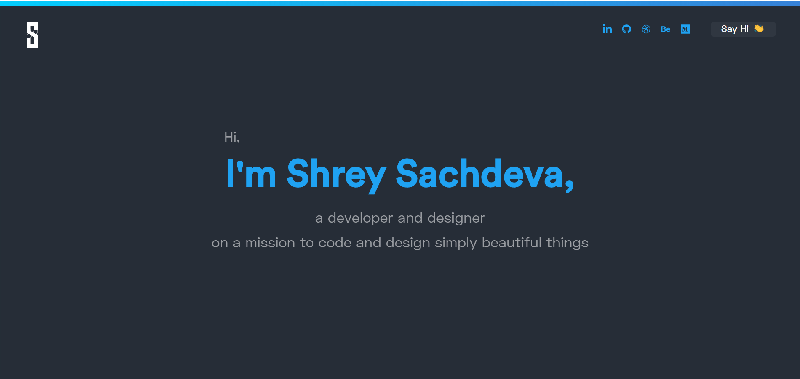

<div align="center">
  
</div>
<h1 align="center">
  shreysachdeva.tech
</h1>
<p align="center">
  The first iteration of <a href="https://shreysachdeva.tech" target="_blank">shreysachdeva.tech</a> built with <a href="https://www.gatsbyjs.org/" target="_blank">Gatsby</a> and hosted with <a href="https://www.netlify.com/" target="_blank">Netlify</a>
</p>

<div align="center">
  
</div>

<p align="center">
crafted with <span style="color: #8b0000;">&hearts;</span> by Shrey Sachdeva.
</p>

## 🛠 Installation & Set Up

1. Install the Gatsby CLI

   ```sh
   npm install -g gatsby-cli
   ```

2. Install dependencies

   ```sh
   npm install
   ```

3. Start the development server

   ```sh
   gatsby develop
   ```

## 🚀 Building and Running for Production

1. Generate a full static production build

   ```sh
   gatsby build
   ```

1. Preview the site as it will appear once deployed

   ```sh
   gatsby serve
   ```
   
## 🎨 Color Reference

| Color          | Hex                                                                |
| -------------- | ------------------------------------------------------------------ |
| Dodger Blue    |  `#1FA2F2` |
| Shark          |  `#262d37` |
| Outer Space    |  `#303741` |

## 🧐 What's inside?

A quick look at the top-level files and directories you'll see in a Gatsby project.

    .
    ├── node_modules
    ├── src
    ├── .gitignore
    ├── .prettierrc
    ├── gatsby-browser.js
    ├── gatsby-config.js
    ├── gatsby-node.js
    ├── gatsby-ssr.js
    ├── LICENSE
    ├── package-lock.json
    ├── package.json
    └── README.md

1.  **`/node_modules`**: This directory contains all of the modules of code that your project depends on (npm packages) are automatically installed.

2.  **`/src`**: This directory will contain all of the code related to what you will see on the front-end of this site (what you see in the browser) such as your site header or a page template. `src` is a convention for “source code”.

3.  **`.gitignore`**: This file tells git which files it should not track / not maintain a version history for.

4.  **`.prettierrc`**: This is a configuration file for [Prettier](https://prettier.io/). Prettier is a tool to help keep the formatting of your code consistent.

5.  **`gatsby-browser.js`**: This file is where Gatsby expects to find any usage of the [Gatsby browser APIs](https://www.gatsbyjs.org/docs/browser-apis/) (if any). These allow customization/extension of default Gatsby settings affecting the browser.

6.  **`gatsby-config.js`**: This is the main configuration file for a Gatsby site. This is where you can specify information about your site (metadata) like the site title and description, which Gatsby plugins you’d like to include, etc. (Check out the [config docs](https://www.gatsbyjs.org/docs/gatsby-config/) for more detail).

7.  **`gatsby-node.js`**: This file is where Gatsby expects to find any usage of the [Gatsby Node APIs](https://www.gatsbyjs.org/docs/node-apis/) (if any). These allow customization/extension of default Gatsby settings affecting pieces of the site build process.

8.  **`gatsby-ssr.js`**: This file is where Gatsby expects to find any usage of the [Gatsby server-side rendering APIs](https://www.gatsbyjs.org/docs/ssr-apis/) (if any). These allow customization of default Gatsby settings affecting server-side rendering.

9.  **`LICENSE`**: Gatsby is licensed under the MIT license.

10. **`package-lock.json`** (See `package.json` below, first). This is an automatically generated file based on the exact versions of your npm dependencies that were installed for your project. **(You won’t change this file directly).**

11. **`package.json`**: A manifest file for Node.js projects, which includes things like metadata (the project’s name, author, etc). This manifest is how npm knows which packages to install for your project.

12. **`README.md`**: A text file containing useful reference information about your project.

## 🚨 Forking this repo

Can you use this code for your own website? The answer to that question is _usually_ "yes", with attribution. There are some cases, such as using this code for a business or something that is greater than a personal project, that I may be less comfortable saying yes to. If in doubt, please don't hesitate to ask me.

I value keeping this site open source, but as you all know, _**plagiarism is bad**_. I spent a non-negligible amount of effort developing, designing, and trying to perfect this iteration of my website, and I am proud of it! All I ask is to not claim this effort as your own.

So, feel free to fork this repo. If you do, please just give me proper credit by linking back to my website, https://shreysachdeva.tech. Refer to this handy [quora post](https://www.quora.com/Is-it-bad-to-copy-other-peoples-code) if you're not sure what to do. Thanks!
